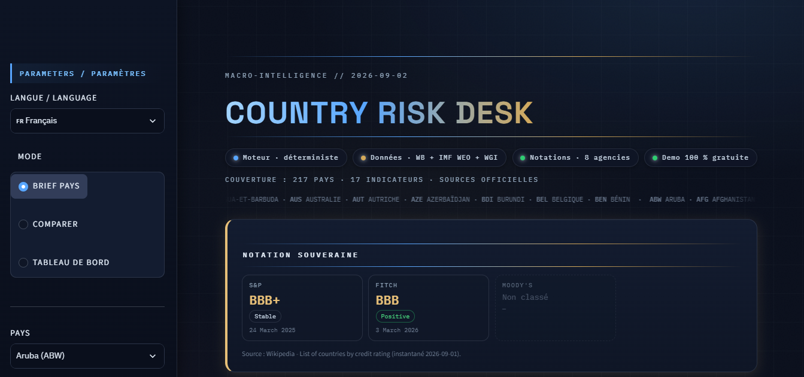

# 🛰 Country Risk Desk

> Version anglaise : [README.md](README.md)

Outil d'analyse macro-financière du risque pays, fondé sur des données officielles et des règles documentées. Il intègre également une analyse de scénarios qui évalue, pour chaque indicateur, l'effet d'un changement de valeur sur les signaux de risque et d'opportunité.

Interface bilingue 🇫🇷/🇬🇧 · 217 économies · 17 indicateurs · notations souveraines S&P, Moody's et Fitch · sources officielles.



<p align="left">
  
  
  
  
  
  
  
  
  
  
  
  
</p>

## Table des matières

- [Objet de l'application](#objet-de-lapplication)
- [Trois modes de lecture](#trois-modes-de-lecture)
- [Provenance des données](#provenance-des-données)
- [Principes méthodologiques](#principes-méthodologiques)
- [Limites assumées](#limites-assumées)
- [Démonstrations en ligne](#démonstrations-en-ligne)
- [Installation locale](#installation-locale)
- [Structure du projet](#structure-du-projet)
- [Actualisation des données](#actualisation-des-données)
- [Documentation et tests](#documentation-et-tests)
- [Auteur](#auteur)
- [Licence](#licence)

## Objet de l'application

Country Risk Desk permet d'établir, pour chacune des 217 économies couvertes, un dossier d'analyse structuré à partir de l'un des 17 indicateurs macroéconomiques et de gouvernance disponibles :

| Repère | Section | Contenu |
| --- | --- | --- |
| - | Notation souveraine | Notations de long terme en devise étrangère de S&P Global Ratings, Moody's et Fitch Ratings, accompagnées de leur perspective et de leur date de décision ; mention « Non classé » lorsque le pays n'est pas noté |
| 01 | Constat chiffré | Dernière valeur publiée et date de référence, variations à 3 et 12 mois, position par rapport à la médiane régionale, tendance quinquennale, courbe de progression |
| - | Analyse de scénarios | Curseur interactif : teste une valeur hypothétique de l'indicateur et affiche les risques/opportunités que les seuils déclencheraient ou lèveraient (comparaison déterministe, pas une prévision) |
| 02 | Risques à 12 mois | Signaux déclenchés par des seuils explicites (inflation supérieure à 10 %, réserves inférieures à 3 mois d'importations, dette supérieure à 90 % du PIB, etc.) |
| 03 | Opportunités à 12 mois | Signaux symétriques lorsque l'évolution franchit les seuils dans le sens favorable |
| 04 | Projections FMI | Trajectoire issue des perspectives WEO (avril 2026) pour 2027-2031, comparée à la tendance observée sur 12 mois |

## Trois modes de lecture

- **Brief pays** - le dossier structuré décrit ci-dessus ; exportable aux formats PDF (français ou anglais), CSV et Excel.
- **Comparaison** - jusqu'à 12 pays simultanément : courbes par indicateur avec unités, tableau des dernières valeurs publiées, positionnement croissance × inflation.
- **Vue globale** - carte des notations souveraines par agence, distribution des notations, synthèse des pays couverts (pays notés, catégorie investment grade, catégorie spéculative, défaut ou notation retirée, pays non notés) et suivi des seuils ; chaque entrée renvoie vers le brief du pays concerné. Lecture croisée des agences incluse : divergences de classification, écarts ≥ 2 crans, perspectives opposées, avec dates de décision.

## Provenance des données

| Source | Contenu |
| --- | --- |
| Banque mondiale - WDI | Séries macroéconomiques et sociales, 2000-2024 |
| Banque mondiale - WGI 2024 | Stabilité politique, maîtrise de la corruption, efficacité du gouvernement, état de droit, qualité réglementaire (2000-2024) |
| FMI - WEO (avril 2026) | Solde budgétaire, dette brute générale : historique et projections 2027-2031 |
| Agences de notation | Notations, perspectives et dates reprises sur Wikipédia depuis [List of countries by credit rating](https://en.wikipedia.org/wiki/List_of_countries_by_credit_rating) (consulté le 1er septembre 2026), contrôlées sur les publications des agences |

## Principes méthodologiques

- L'application ne calcule aucune notation ni aucun score qui lui soit propre : elle présente les publications officielles et les signaux issus de seuils documentés, consultables dans `docs/ARCHITECTURE.md`.
- Aucune valeur n'est estimée ni complétée : une donnée absente est présentée comme absente ; un pays non noté est présenté comme non noté.
- Chaque signal mentionne la règle et le seuil qui le déclenchent ; chaque dossier cite ses sources et leurs dates.
- Les notations des agences sont reproduites sans interprétation ni agrégation.

## Limites assumées

- Les séries macroéconomiques proviennent de millésimes annuels ou irréguliers : les comparaisons entre pays portent sur la dernière valeur disponible de chaque pays, pas sur une date synchronisée.
- Les notations souveraines correspondent à un instantané (1er septembre 2026) ; seule une révision manuelle des CSV les actualise.
- Les indicateurs WGI sont des estimations statistiques assorties d'intervalles de confiance ; l'application affiche l'estimation ponctuelle.
- L'application ne produit aucun score agrégé ni classement : c'est un outil d'aide à l'analyse, pas une opinion de crédit.

## Démonstrations en ligne

<a href="https://country-risk-desk.streamlit.app/" target="_blank"></a> sur Streamlit Cloud

<a href="https://country-risk-desk.onrender.com/" target="_blank"></a> sur Render

## Installation locale

```bash
git clone https://github.com/maxin-dac/country-risk-desk.git
cd country-risk-desk
pip install -r requirements.txt
streamlit run app.py
```

## Structure du projet

```text
country-risk-desk/
├── app.py               # entrée Streamlit (brief / comparaison / vue globale)
├── src/
│   ├── csv_loader.py    # chargement CSV + statistiques (variations, médiane, tendance)
│   ├── ratings.py       # lecture des notations souveraines (S&P, Moody's, Fitch)
│   ├── alerts.py        # règles de seuils : signaux de risque et d'opportunité
│   ├── projections.py   # trajectoire FMI + comparaison à la tendance
│   ├── dashboard.py     # carte des notations, distribution, synthèse
│   ├── compare.py       # courbes et tableaux de comparaison
│   ├── analytics.py     # analyse de scénarios + lecture croisée des agences
│   ├── ui_render.py     # rendu HTML des briefs
│   ├── ui_theme.py      # charte graphique + masthead
│   ├── plot_theme.py    # thème Plotly et unités (référence unique)
│   ├── i18n.py          # libellés FR/EN, ordre des indicateurs, unités
│   └── pdf_export.py    # export PDF bilingue
├── scripts/             # fetch (BM, WGI, FMI), panneaux de données & générateur de doc
├── data/                # CSV/XLSX versionnés, notations, countries.csv, panneaux intermédiaires
├── docs/                # ARCHITECTURE.md + API.md
├── tests/               # pytest (règles de seuils)
└── assets/              # theme.css + captures
```

## Actualisation des données

```bash
python scripts/fetch_worldbank.py
python scripts/fetch_wgi.py
python scripts/fetch_imf.py
python scripts/fetch_risk_extras.py
```

- Les notations souveraines sont actualisées par révision des fichiers `data/ratings_sp.csv`, `data/ratings_moodys.csv` et `data/ratings_fitch.csv`, à partir d'un nouvel instantané de la page Wikipédia et des publications des agences.
- Les indicateurs État de droit et Qualité réglementaire sont extraits de l'extrait officiel `WGI.xlsx` (feuilles `rl`/`rq`).

## Documentation et tests

- `docs/ARCHITECTURE.md` - indicateurs, ancres, règles de seuils, sources.
- `docs/API.md` - référence générée par `python scripts/build_docs.py`.
- `pytest` - tests unitaires des règles de seuils.

## Auteur

Maxime NDACLEU - BI & Data Analyst

<p align="left">
<a href="https://github.com/maxin-dac"></a>
<a href="https://www.linkedin.com/in/maximendacleu"></a>
</p>

## Licence

MIT. Les séries proviennent de la Banque mondiale et du FMI ; les notations appartiennent à leurs agences respectives et sont reproduites à des fins d'information uniquement.
