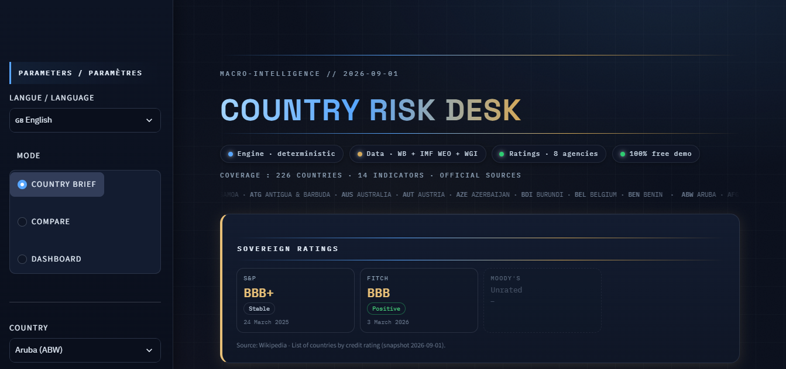

# 🛰 Country Risk Desk

**Deterministic macro-financial country risk desk.**
Bilingual 🇫🇷/🇬🇧 · 226 economies · 17 indicators · 4 pillars · official sources only.

> **French version:** [README.fr.md](README.fr.md)

<p align="left">


</p>



## What it does

Pick any of **226 economies** and one of **17 risk indicators**, and get a complete, sourced brief:

| # | Section | Content |
|---|---------|---------|
| — | **Risk score** | Aggregate 0-100 score (4 pillars, weights 30/30/20/20), rank, pillar bars |
| 01 | Key figures | Latest value + date, 3/12-month deltas, regional median, 5-yr trend, merged progression chart |
| 02 | Context — official sources | Mini search-engine view: verified page titles, indexed risk words, clean snippet when quality allows, links to follow |
| 03 | 12-month risks | Deterministic threshold rules (inflation > 10 %, reserves < 3 months of imports, debt > 90 % GDP…) |
| 04 | 12-month opportunities | Mirrored opportunity rules |
| 05 | Uncertainties | Explicit when information is thin — never invented |
| 06 | IMF projections | WEO Apr-2026 trajectory 2027-2031 + divergence detection vs 12-month trend |
| 07 | Sources & limitations | Clickable bibliography (IMF, World Bank, WGI) + honest limits |

## Three ways to read the desk

- **Country brief** - the structured report above; exportable to **PDF (FR/EN)**, **CSV**, **Excel**.
- **Comparison** - up to 12 countries: per-indicator curves with units, latest-values table, growth-vs-inflation positioning, relative-risk ranking.
- **Global view** - world choropleth of risk, score distribution with clickable categories, Top 10 riskiest, threshold alerts (red, one click → country brief).

## Data provenance

| Source | Content |
|--------|---------|
| World Bank WDI | 13 macro/social series, 2000-2024 |
| World Bank WGI 2024 | Political stability, corruption, rule of law, regulatory quality |
| IMF WEO (Apr 2026) | Fiscal balance, general government debt - history + projections 2027-2031 |
| Computed | External debt service (TDS / exports of goods & services) |

## Honesty & explainability by design

- Every judgment is a documented rule or threshold - see `docs/ARCHITECTURE.md`.
- No verified source → *“Insufficient information”*, never padded.
- Missing IMF / World Bank values displayed as missing.

## Live demo

<a href="https://country-risk-desk.streamlit.app/" target="_blank"></a> on **Streamlit Cloud**

<a href="https://country-risk-desk.onrender.com/" target="_blank"></a> on **Render**

## Run it locally

```bash
    git clone https://github.com/maxin-dac/country-risk-desk.git
    cd country-risk-desk
    pip install -r requirements.txt
    streamlit run app.py
```

## Project structure

```bash
    country-risk-desk/
    ├── app.py               # Streamlit entry (brief / comparison / global view)
    ├── src/
    │   ├── csv_loader.py    # CSV load + stats (deltas, regional median, 5-yr trend)
    │   ├── risk_scoring.py  # sub-scores, aggregate score, Top 10
    │   ├── alerts.py        # threshold alerts engine
    │   ├── projections.py   # IMF trajectory + divergence
    │   ├── dashboard.py     # choropleth, distribution, global view
    │   ├── compare.py       # comparison charts & tables
    │   ├── sources_view.py  # section 02 "search results" renderer
    │   ├── web_search.py    # Tavily / DuckDuckGo qualified search
    │   ├── graph.py         # deterministic brief assembly
    │   ├── ui_render.py     # brief HTML rendering
    │   ├── ui_theme.py      # design system + masthead
    │   ├── plot_theme.py    # Plotly theme + units (single source of truth)
    │   ├── i18n.py          # FR/EN strings, RISK_ORDER, units
    │   └── pdf_export.py    # bilingual PDF export
    ├── scripts/             # data fetchers (WB, WGI, IMF) + doc generator
    ├── data/                # committed CSV/XLSX (refreshable)
    ├── docs/                # ARCHITECTURE.md + API.md
    ├── tests/               # pytest (rules & scoring)
    └── assets/              # theme.css + screenshots
```

## Refreshing the data

```bash
    python scripts/fetch_worldbank.py
    python scripts/fetch_wgi.py
    python scripts/fetch_imf.py
    python scripts/fetch_risk_extras.py
```

## Documentation & tests

- `docs/ARCHITECTURE.md` - pillars, anchors, weights, rules, sources.
- `docs/API.md` - reference: `python scripts/build_docs.py`.
- `pytest` - rules & scoring unit tests.

## Author

**Maxime NDACLEU** - Data Analyst & Business Intelligence Analyst

<p>
<a href="https://github.com/maxin-dac"></a>
<a href="https://www.linkedin.com/in/maximendacleu"></a>
</p>

## License

MIT. Data © World Bank / IMF; excerpts © their publishers, cited with attribution for analysis purposes.
