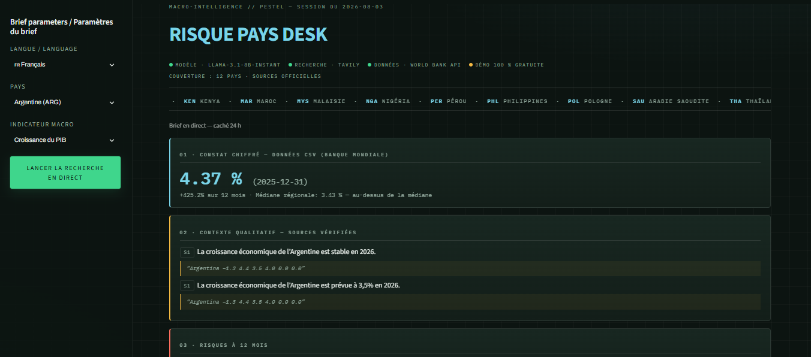

# 🛰 Country Risk Desk

> **Problem**: country-risk analysis oscillates between two hard-to-reconcile extremes: raw macro data with no context, or unverified qualitative commentary (hallucinations, loose sourcing). Analysts need both: reliable figures **and** sourced context, without paying for a proprietary terminal.  
> **Solution**: an open-source, bilingual country-risk desk combining **13 World Bank indicators** (217 economies, 2000–2024) with **qualitative context from trusted sources** (Reuters, Bloomberg, IMF, World Bank, FT). A LangGraph agent drafts each brief, then a validation layer checks every claim against verbatim quotes: **anything ungrounded is removed before display**. No key, no sign-up, no wait.

<p align="left">
  
  
  
  
  
  
  
  
  
  
  
</p>

<p align="left">
  <a href="https://country-risk-desk.streamlit.app/">
    
  </a>
</p>



🇫 Français : [README.fr.md](README.fr.md)

---

## Summary

- **What it does**: generates macro-financial briefs for 217 economies - World Bank quantitative read, verified qualitative context quoted verbatim, and 12-month risks & opportunities synthesized by an LLM **checked claim by claim**.
- **Skills involved**: agentic AI (LangGraph), grounded LLMs & claim-level validation, trusted-domain web search, data engineering, CI/CD, bilingual UX, PDF export.
- **Demo**: [country-risk-desk.streamlit.app](https://country-risk-desk.streamlit.app/)
- **Stack**: Python · Streamlit · LangGraph · Groq · Tavily · Plotly · pandas · GitHub Actions · World Bank API

## What a Brief Contains

| # | Section | Source |
|---|---|---|
| 01 | Quantitative read: latest value, deltas, regional median + 2000–2024 progression chart | World Bank (WDI + WGI) |
| 02 | Qualitative context: verified claims, each backed by a verbatim quote | Reuters, Bloomberg, IMF, World Bank, FT |
| 03 | 12-month risks | grounded LLM synthesis |
| 04 | 12-month opportunities | grounded LLM synthesis |
| 05 | Uncertainties | - |
| 06 | Cited sources, clickable and domain-validated | - |

**13 indicators**: GDP growth, inflation, interest rate, current account, government debt, external debt, reserves, unemployment · GHG emissions per capita, electricity access, women in labor force, political stability, control of corruption.

## Three Ways to Read the Desk

- **Country brief** - the structured report above, exportable to PDF in both languages.
- **Comparison** - up to 12 countries side by side: interactive per-indicator curves, latest-values table, growth-vs-inflation positioning map.
- **Threshold alerts** - inflation > 10 %, reserves < 3 months of imports, debt > 90 % of GDP…; one click jumps to the country.

## Honesty by Design

- No verified source → “Information insufficient.” The system **never invents** analysis.
- Every qualitative claim displays its source ID (`S1`, `S2`…) and the exact quote it was checked against.
- A validation layer cross-checks LLM output against retrieved sources; ungrounded claims are removed before display.
- Data provenance is shown, never hidden; missing World Bank values are displayed as such.

## Two Modes, Zero Visitor Constraints

- **Instant library** - data and pre-computed briefs refreshed monthly by GitHub Actions; opening a brief is immediate.
- **Live search** - on demand, a LangGraph agent searches (Tavily, trusted domains), drafts (LLM via Groq), validates every claim, and caches for 24 h. Keys live server-side.

## Run It Locally

```bash
git clone https://github.com/maxin-dac/country-risk-desk.git
cd country-risk-desk
pip install -r requirements.txt
# .env with your own keys (never committed):
#   TAVILY_API_KEY=...  LLM_BASE_URL=...  LLM_API_KEY=...  LLM_MODEL=...
streamlit run app.py
```

## Architecture

```text
country-risk-desk/
├── app.py                  # thin Streamlit entry (state, caches, orchestration)
├── src/
│   ├── graph.py            # LangGraph agent: search → draft → validate → assemble
│   ├── web_search.py       # Tavily search, restricted to trusted domains
│   ├── llm.py              # OpenAI-compatible client (Groq / OpenRouter / DashScope)
│   ├── validation.py       # quote & domain verification
│   ├── csv_loader.py       # World Bank stats (latest, deltas, regional median)
│   ├── alerts.py           # threshold alerts engine
│   ├── compare.py          # comparison charts (Plotly)
│   ├── pdf_export.py       # bilingual PDF export
│   ├── i18n.py             # FR/EN strings; country & indicator names (CLDR via Babel)
│   ├── ui_render.py        # HTML rendering of briefs
│   └── ui_theme.py         # design system (CSS, masthead)
├── scripts/
│   ├── fetch_worldbank.py  # bulk World Bank fetch (217 economies × 13 indicators)
│   └── generate_library.py # monthly brief pre-computation
└── .github/workflows/      # monthly refresh + auto-commit
```

## Limitations

- Qualitative coverage depends on trusted-domain media availability per country; thin coverage is reported as insufficient, never padded.
- Government debt and governance indices have sparser World Bank coverage than other series.
- Free-tier LLM/search quotas can delay live generation during heavy use.

## Roadmap

v2 indicators: Gini, FDI inflows, remittances, commodity dependence · pushed alerts · scenario notes.

---

## Author

**Maxime NDACLEU** - Data Analyst & Business Intelligence Analyst

<p align="left">
  <a href="https://github.com/maxin-dac">
    
  </a>
  <a href="https://www.linkedin.com/in/maximendacleu">
    
  </a>
</p>

---

## License

Portfolio project distributed under the MIT License. Data © World Bank; excerpts © their respective publishers, quoted with attribution for analysis purposes.
