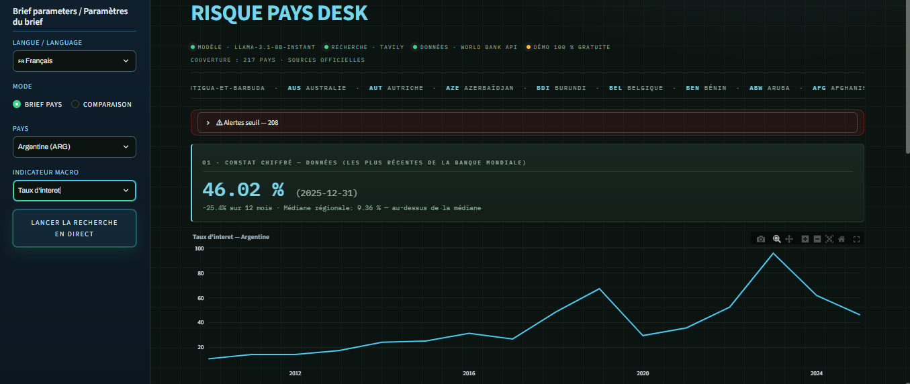

> [🇫🇷 Français](README.fr.md) | 🇬🇧 English

# 🛰 Country Risk Desk

**Macro-financial country briefs grounded in verified sources.**  
Bilingual 🇫🇷/🇧 · No key, no sign-up, no wait.

[](https://country-risk-desk.streamlit.app)




---

## What it does

Pick any of **217 economies** and one of **13 indicators**:

- **Macro core** — GDP growth, inflation, interest rate, current account, government debt, external debt, reserves, unemployment
- **ESG & governance** — GHG emissions per capita, electricity access, women in labor force, political stability, control of corruption

| # | Section | Source |
|---|---------|--------|
| 01 | Quantitative read: latest value, deltas, regional median + **2000–2024 progression chart** | World Bank (WDI + WGI) |
| 02 | Qualitative context: verified claims, each backed by a **verbatim quote** | Reuters, Bloomberg, IMF, World Bank, FT |
| 03 | 12-month risks | grounded LLM synthesis |
| 04 | 12-month opportunities | grounded LLM synthesis |
| 05 | Uncertainties | — |
| 06 | Cited sources, clickable and domain-validated | — |

### Three ways to read the desk

- **Country brief** — the structured report above, exportable to PDF in both languages.
- **Comparison** — up to 12 countries side by side: interactive per-indicator curves, latest-values table, growth-vs-inflation positioning map.
- **Threshold alerts** — countries crossing analyst thresholds (inflation > 10 %, reserves < 3 months of imports, debt > 90 % of GDP…); one click jumps to the country.

## Honesty by design

- **No verified source → "Information insufficient."** The system never invents analysis.
- Every qualitative claim displays its source ID (`S1`, `S2`…) and the exact quote it was checked against.
- A validation layer cross-checks LLM output against retrieved sources; ungrounded claims are removed before display.
- Data provenance is shown, never hidden; missing World Bank values are displayed as such.

## Two modes, zero visitor constraints

- **Instant library** — data and pre-computed briefs are refreshed **monthly by GitHub Actions** and committed to this repo. Opening a brief is immediate; nothing runs on the visitor's side.
- **Live search** — on demand, a LangGraph agent performs a domain-restricted web search (Tavily), drafts the brief (LLM via LiteLLM with OpenRouter), validates every claim, and caches the result for 24 h. Keys live server-side; visitors provide nothing.

## Architecture

```text
country-risk-desk/
├── app.py                  # thin Streamlit entry (state, caches, orchestration)
├── src/
│ ├── ui_render.py          # HTML rendering of briefs
│ ├── ui_theme.py           # design system (CSS, masthead)
│ ├── i18n.py               # FR/EN strings; country & indicator names (CLDR via Babel)
│ ├── graph.py              # LangGraph agent: search → draft → validate → assemble
│ ├── web_search.py         # Tavily search, restricted to trusted domains
│ ├── llm.py                # LiteLLM router (OpenRouter / fallbacks)
│ ├── validation.py         # quote & domain verification
│ ├── csv_loader.py         # World Bank stats (latest, deltas, regional median)
│ ├── alerts.py             # threshold alerts engine
│ ├── compare.py            # comparison charts (Plotly)
│ └── pdf_export.py         # bilingual PDF export
├── scripts/
│ ├── fetch_worldbank.py    # bulk World Bank fetch (217 economies × 13 indicators)
│ └── generate_library.py   # monthly brief pre-computation
├── .github/workflows/      # monthly refresh + auto-commit
└── assets/                 # screenshots & images
```

## Live demo

https://country-risk-desk.streamlit.app/

## Run it locally

```bash
git clone https://github.com/maxin-dac/country-risk-desk.git
cd country-risk-desk
pip install -r requirements.txt

# .env with your own keys (never committed):
#   TAVILY_API_KEY=...
#   LLM_PROVIDER=openrouter  # or groq
#   LLM_API_KEY=...
#   LLM_MODEL=meta-llama/llama-3.1-8b-instruct
#   LLM_BASE_URL=https://openrouter.ai/api/v1

streamlit run app.py
```

## Limitations

- Qualitative coverage depends on trusted-domain media availability per country; thin coverage is reported as insufficient, never padded.
- Government debt and governance indices have sparser World Bank coverage than other series.
- Free-tier LLM/search quotas can delay live generation during heavy use.

## Roadmap

v2 indicators: Gini, FDI inflows, remittances, commodity dependence · pushed alerts · scenario notes.

---

## Author

**Maxime NDACLEU** - Data Analyst & Business Intelligence Analyst

<p align="left">
  <a href="https://github.com/maxin-dac">
    
  </a>
  <a href="https://www.linkedin.com/in/maximendacleu">
    
  </a>
</p>

---

## License

Project distributed under the MIT License. Data © World Bank; excerpts © their respective publishers, quoted with attribution for analysis purposes.
