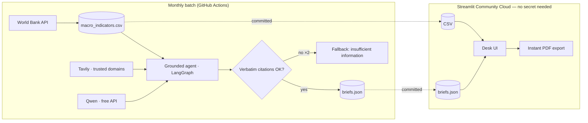

# 🛰 PESTEL Risk Desk

A pre-computed library of factual PESTEL briefs per country × macro indicator.
Figures from the World Bank API · qualitative context from verified sources (Reuters, Bloomberg, IMF, World Bank) ·
**no claim without a verbatim citation** · “Insufficient information” when evidence is missing.
Bilingual: 🇫🇷 / 🇬🇧. *Interface bilingue, données 100 % réelles.*

 

## Visitor experience

**No key. No sign-up. No wait.** Briefs are generated ahead of time by a grounded
agent pipeline and refreshed monthly by GitHub Actions. The app itself needs zero secret.

## How it works



## Coverage tiers

| Tier | Scope | Cost | Content |
|---|---|---|---|
| Figures | ~200 economies | 0 (pure pandas) | latest value, trends, regional comparison |
| Qualitative | 20 featured countries | one-time batch | sourced context, risks, opportunities |

## Run locally

```bash
pip install -r requirements.txt
python scripts/fetch_worldbank.py     # real data, ~200 economies, no key
python scripts/generate_library.py    # optional: featured briefs (Tavily + LLM keys in .env)
streamlit run app.py                  # works without any key: figures for every country
```
