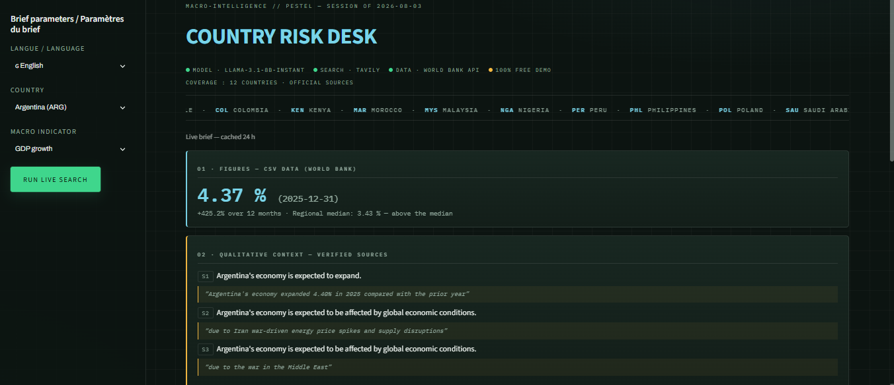

# 🛰 Country Risk Desk

> [🇫🇷 Français](README.fr.md) | 🇬🇧 English

**Macro-financial country briefs grounded in verified sources.**
Bilingual 🇫🇷/🇬🇧 · No key, no sign-up, no wait.

---

## What it does

Pick a country and a macro indicator — **GDP growth**, **inflation**, **interest rate**.
The desk assembles a structured brief:

| # | Section | Source |
|---|---------|--------|
| 01 | Quantitative read: latest value, 3/12-month changes, regional median positioning | World Bank |
| 02 | Qualitative context: verified claims, each backed by a **verbatim quote** | Reuters, Bloomberg, IMF, World Bank, FT |
| 03 | 12-month risks | grounded LLM synthesis |
| 04 | 12-month opportunities | grounded LLM synthesis |
| 05 | Uncertainties | — |
| 06 | Cited sources, clickable and domain-validated | — |

One click exports the full brief as a **PDF**, in either language.

## Honesty by design

- **No verified source → “Information insufficient.”** The system never invents analysis.
- Every qualitative claim displays its source ID (`S1`, `S2`…) and the exact quote it was checked against.
- A validation layer cross-checks LLM output against retrieved sources; ungrounded claims are removed before display.
- Data provenance is shown, never hidden.

## Two modes, zero visitor constraints

- **Instant library** — data and pre-computed briefs are refreshed **monthly by GitHub Actions** and committed to this repo. Opening a brief is immediate; nothing runs on the visitor's side.
- **Live search** — on demand, a LangGraph agent performs a domain-restricted web search (Tavily), drafts the brief (LLM via Groq), validates every claim, and caches the result for 24 h. Keys live server-side; visitors provide nothing.

## Architecture

    app.py                  thin Streamlit entry (state, caches, orchestration)
    src/
      ui_render.py          HTML rendering of briefs
      ui_theme.py           design system (CSS, masthead)
      i18n.py               FR/EN strings, country & indicator names
      graph.py              LangGraph agent: search → draft → validate → assemble
      web_search.py         Tavily search, restricted to trusted domains
      llm.py                OpenAI-compatible client (Groq / OpenRouter / DashScope)
      validation.py         quote & domain verification
      csv_loader.py         World Bank data stats (latest, deltas, regional median)
      pdf_export.py         bilingual PDF export
    scripts/
      fetch_worldbank.py    bulk World Bank fetch (~200 economies, incremental)
      generate_library.py   monthly brief pre-computation
    .github/workflows/      monthly refresh + auto-commit

## Run it locally

    git clone https://github.com/maxin-dac/pestel-risk-desk.git
    cd pestel-risk-desk
    pip install -r requirements.txt
    # .env with your own keys (never committed):
    #   TAVILY_API_KEY=...  LLM_BASE_URL=...  LLM_API_KEY=...  LLM_MODEL=...
    streamlit run app.py

## Limitations

- Qualitative coverage depends on trusted-domain media availability per country; thin coverage is reported as insufficient, never padded.
- Free-tier LLM/search quotas can delay live generation during heavy use.

## Roadmap

- Wider indicator set (debt, trade, energy) · ESG layer · country alerts.

---

*Data Source © World Bank; excerpts © their respective publishers, quoted with attribution for analysis purposes.*

---

## Author

**Maxime NDACLEU** — Data Analyst & Business Intelligence Analyst

  
  

