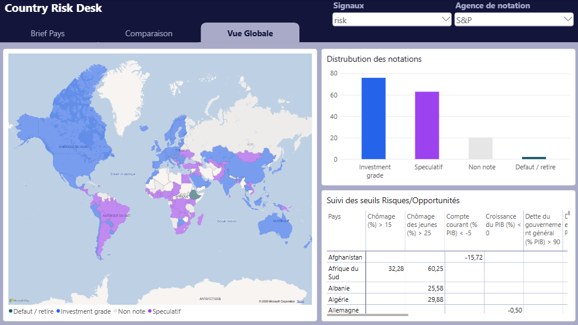

# 🛰 Country Risk Desk

> French version: [README.fr.md](README.fr.md)

Macro-financial country risk analysis tool, based on official data and documented rules. It also includes a scenario analysis that assesses, for each indicator, how a change in value would affect the risk and opportunity signals.

Bilingual interface 🇫🇷/🇬🇧 · 217 economies · 17 indicators · sovereign ratings from S&P, Moody's, and Fitch · official sources.


<p align="left">
  

  
  
  
  
  
  
  
  
  
  
  
</p>

## Table of contents

- [Purpose of the application](#purpose-of-the-application)
- [Three reading modes](#three-reading-modes)
- [Data sources](#data-sources)
- [Methodological principles](#methodological-principles)
- [Assumed limitations](#assumed-limitations)
- [Live demonstrations](#live-demonstrations)
- [Local installation](#local-installation)
- [Project structure](#project-structure)
- [Data refresh](#data-refresh)
- [Documentation and tests](#documentation-and-tests)
- [Power BI Twin](#power-bi-twin)
- [Author](#author)
- [License](#license)

## Purpose of the application

Country Risk Desk provides a structured analysis brief for each of the 217 covered economies, based on any of the 17 available macroeconomic and governance indicators:

| Ref | Section | Content |
| --- | --- | --- |
| - | Sovereign rating | Long-term foreign currency ratings from S&P Global Ratings, Moody's, and Fitch Ratings, along with their outlook and decision date; "Unrated" is shown when the country is not rated |
| 01 | Key figures | Latest published value and reference date, 3- and 12-month changes, position relative to the regional median, 5-year trend, and progression chart |
| -|Scenario analysis|Interactive slider: tests a hypothetical indicator value and shows which threshold-based risks/opportunities would trigger or clear (deterministic comparison, not a forecast)|
| 02 | 12-month risks | Signals triggered by explicit thresholds (e.g., inflation > 10%, reserves < 3 months of imports, debt > 90% of GDP) |
| 03 | 12-month opportunities | Symmetrical signals triggered when trends cross thresholds in a favorable direction |
| 04 | IMF Projections | Trajectory from WEO outlooks (April 2026) for 2027-2031, compared against the 12-month trend |

## Three reading modes

- **Country brief** - the structured report described above; exportable to PDF (French or English), CSV, and Excel formats.
- **Compare** - up to 12 countries simultaneously: indicator charts with units, table of the latest published values, growth × inflation positioning.
- **Dashboard** - map of sovereign ratings by agency, rating distribution, summary of covered countries (rated countries, investment grade, speculative grade, default or withdrawn, unrated countries), and threshold monitoring; each entry links to the relevant country brief.

## Data sources

| Source | Content |
| --- | --- |
| World Bank - WDI | Macroeconomic and social series, 2000-2024 |
| World Bank - WGI 2024 | Political stability, control of corruption, government effectiveness, rule of law, regulatory quality (2000-2024) |
| IMF - WEO (April 2026) | Fiscal balance, general government gross debt: historical and 2027-2031 projections |
| Rating agencies | Ratings, outlooks, and dates sourced from Wikipedia via [List of countries by credit rating](https://en.wikipedia.org/wiki/List_of_countries_by_credit_rating) (accessed on September 1, 2026), verified against agency publications |

## Methodological principles

- The application does not compute any proprietary ratings or scores: it presents official publications and signals derived from documented thresholds, available in `docs/ARCHITECTURE.md`.
- No missing value is estimated or filled: missing data is displayed as missing; an unrated country is shown as unrated.
- Every signal mentions the specific rule and threshold that triggered it; every brief cites its sources and dates.
- Agency ratings are reproduced without interpretation or aggregation.

## Assumed limitations

- Macroeconomic series come from annual or irregular vintages: cross-country comparisons use each country's latest available value, not a synchronized date.
- Sovereign ratings correspond to a snapshot (September 1, 2026); only a manual revision of the CSV files updates them.
- WGI indicators are statistical estimates with confidence intervals; the application displays the point estimate.
- The application produces no aggregate score and no ranking: it is an analysis aid, not a credit opinion.

## Live demonstrations

<a href="https://country-risk-desk.streamlit.app/" target="_blank"></a> on Streamlit Cloud

<a href="https://country-risk-desk.onrender.com/" target="_blank"></a> on Render

## Local installation

```
git clone https://github.com/maxin-dac/country-risk-desk.git
cd country-risk-desk
pip install -r requirements.txt
streamlit run app.py
```

## Power BI Twin


## Project structure

```
country-risk-desk/
├── app.py                  # Streamlit entry (brief / comparison / global view / threshold monitor)
├── src/
│   ├── csv_loader.py       # CSV loading + statistics (changes, median, trend)
│   ├── ratings.py          # Sovereign ratings reader (S&P, Moody's, Fitch)
│   ├── alerts.py           # Threshold rules: risk and opportunity signals
│   ├── projections.py      # IMF path + comparison with trend
│   ├── dashboard.py        # Ratings map, distribution, summary
│   ├── compare.py          # Comparison charts and tables
│   ├── analytics.py        # Scenario analysis + cross-agency reading
│   ├── ui_render.py        # HTML rendering of briefs
│   ├── ui_theme.py         # Design system + masthead
│   ├── plot_theme.py       # Plotly theme and units (single reference)
│   ├── i18n.py             # FR/EN labels, indicator order (RISK_ORDER), units
│   ├── version.py          # Semantic version (single source of truth)
│   └── pdf_export.py       # Bilingual PDF export
├── scripts/
│   ├── export_powerbi.py   # Power BI twin export (pre-computed pbi_* tables)
│   └── …                   # fetchers (WB, WGI, IMF), data panels & doc generator
├── powerbi/
│   └── data/               # 10 generated pbi_*.csv tables, ready to display
├── data/                   # Versioned CSV/XLSX, ratings, countries.csv, intermediate panels
├── docs/                   # ARCHITECTURE.md + API.md
├── tests/                  # pytest (threshold rules)
├── assets/                 # theme.css + screenshots
├── .github/workflows/      # refresh-data.yml (automated monthly refresh)
├── CHANGELOG.md            # Version journal (Keep a Changelog)
├── README.md / README.fr.md
└── requirements.txt
```

## Data refresh

```
python scripts/fetch_worldbank.py
python scripts/fetch_wgi.py
python scripts/fetch_imf.py
python scripts/fetch_risk_extras.py
```

- Sovereign ratings are updated by reviewing the `data/ratings_sp.csv`, `data/ratings_moodys.csv`, and `data/ratings_fitch.csv` files, using a new snapshot of the Wikipedia page and agency publications.
- The Rule of law and Regulatory quality indicators are extracted from the official `WGI.xlsx` extract (sheets `rl`/`rq`).

## Documentation and tests

- `docs/ARCHITECTURE.md` - indicators, anchors, threshold rules, sources.
- `docs/API.md` - reference generated by `python scripts/build_docs.py`.
- `pytest` - unit tests for threshold rules.

## Power BI twin

> In french only



Alongside the Streamlit app (interactive), a Power BI twin restitutes the same risk framework in reporting mode: `powerbi/` folder.

| Tables `powerbi/data/pbi_*.csv` | Grain |
|---|---|
| pbi_countries / pbi_indicators | dimensions: FR/EN names, regions, units, pillars |
| pbi_latest | 1 row / country × indicator: value + date, changes, median, position, trend |
| pbi_signals / pbi_counts | triggered signals (1 row = 1 signal) and counts per country |
| pbi_position | growth × inflation pre-pivoted (scatter plot) |
| pbi_ratings_long / pbi_ratings_wide | ratings by agency, categories, divergences |
| pbi_history / pbi_projections | historical series and IMF projections 2027-2031 |

Report pages: Country brief (cards, historical curve, projections), Comparison (curves, growth × inflation scatter, signal bars), Global view (choropleth, distribution, threshold monitoring).

## Author

Maxime NDACLEU - Data Analyst & BI

<p align="left">
<a href="https://github.com/maxin-dac"></a>
<a href="https://www.linkedin.com/in/maximendacleu"></a>
</p>

## License

MIT. Series are provided by the World Bank and the IMF; ratings belong to their respective agencies and are reproduced for informational purposes only.
